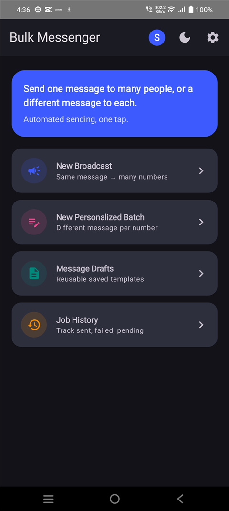
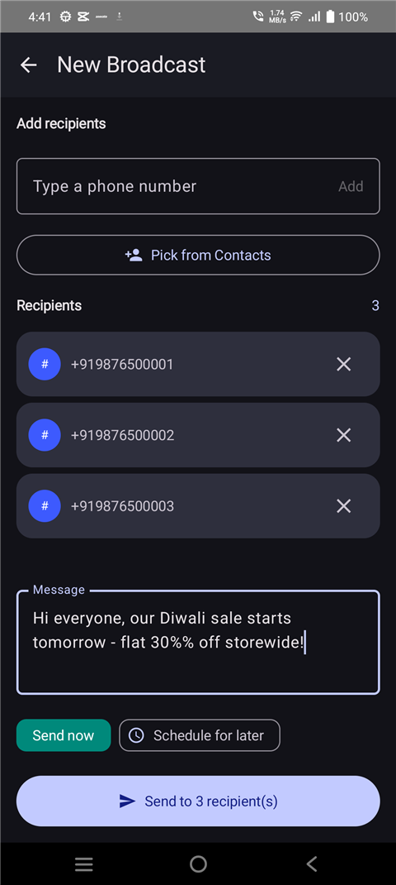
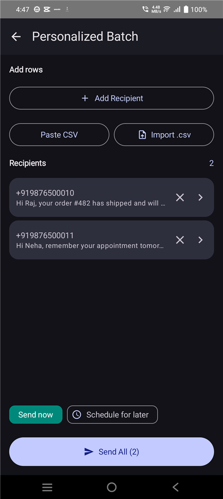
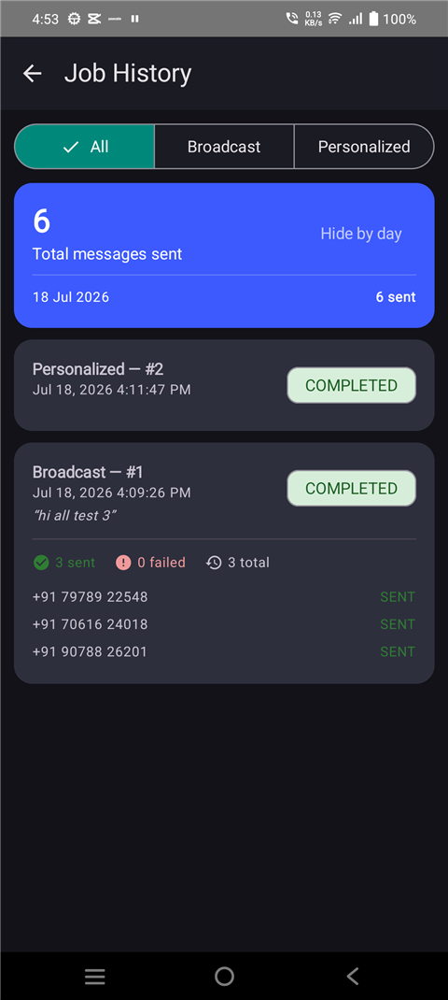

<div align="center">


# Bulk Messenger

**Send one SMS to many people, or a different message to each — without opening a hundred chat threads.**

[](#requirements)
[-informational)](#requirements)
[](#tech-stack)
[](https://github.com/swayam228/bulk-messenger/commits)
[](.)
[](#-scope--limitations)

[Screenshots](#-screenshots) · [Features](#-features) · [Getting started](#-getting-started) · [Full technical docs](docs/index.html) · [Test cases](docs/TEST_CASES.md)

</div>

---

## What it is

Bulk Messenger automates the "open thread → type → send → repeat" grind of texting a list of
numbers by hand. Write the message(s) once — the same one for everyone, or a different one per
recipient — and a background worker sends them one at a time with a throttling delay, so the
send pattern doesn't read as spam to the carrier or trip Android's own bulk-SMS warning.

It's built for **personal/business sideload use**, not Play Store distribution: no backend, no
analytics, no network permission in the manifest at all. Every profile's data lives entirely
on-device until that profile explicitly exports a backup.

## 📱 Screenshots

<table>
<tr>
<td><br/><sub><b>Home</b></sub></td>
<td><br/><sub><b>Broadcast</b></sub></td>
<td><br/><sub><b>Personalized Batch</b></sub></td>
<td><br/><sub><b>Job History</b></sub></td>
</tr>
</table>

More in the [full technical documentation](docs/index.html), including Drafts, Settings, the
profile switcher, and onboarding.

## ✨ Features

<table>
<tr>
<td valign="top" width="25%">

**📣 Broadcast**
Same message → many numbers. Pick contacts, type numbers one at a time, or paste a whole list at
once; send now or schedule. Numbers already messaged today are flagged inline.

</td>
<td valign="top" width="25%">

**📝 Personalized Batch**
A different message per number, as a two-page flow (list + dedicated recipient editor). CSV
paste/import, or paste a bare number list to create blank rows in one go.

</td>
<td valign="top" width="25%">

**📄 Drafts**
Save, edit, and reuse message templates — pick one from a dropdown right on the send screen
instead of retyping.

</td>
<td valign="top" width="25%">

**🕓 Job History**
Per-recipient status, day-by-day totals, how many times each number was messaged today, mode
filters, and a **Retry Failed** button that only appears when there's something to retry.

</td>
</tr>
</table>

**Also included:**

- 👥 **Multi-user profiles** — first-launch onboarding, profile switcher on Home, each profile
  gets its own drafts, job history, theme, and default SIM.
- 📶 **Dual-SIM support** — a SIM picker appears on send screens only when 2+ SIMs are active;
  invisible on single-SIM devices.
- 🛡️ **Reliability** — sending promotes the worker to a foreground service with a live progress
  notification, so aggressive OEM battery managers (Vivo/Oppo/Realme) are far less likely to
  kill a send mid-flight. One-tap battery-exemption shortcut in Settings.
- 💾 **Backup & restore** — automatic backup every 6 hours to a location you choose (set up during
  onboarding or from Settings), plus explicit one-off JSON export/import via the system file
  picker.
- 🌗 **Light / Dark theme**, remembered per profile.

## 🧱 Tech stack

| Layer | Choice |
|---|---|
| Language | Kotlin (coroutines) |
| UI | Jetpack Compose · Material 3 · Navigation Compose |
| Architecture | MVVM — Compose Screen → ViewModel → Repository |
| Persistence | Room (all queries scoped per profile) |
| Background work | WorkManager (foreground service for active sends) |
| System APIs | SmsManager · SubscriptionManager · Storage Access Framework |
| Testing | JUnit4 + AndroidX Test, Compose UI Test, Room in-memory DB |

Full architecture diagram and a permission-by-permission breakdown live in the
[technical documentation](docs/index.html).

## 🚀 Getting started

### Requirements

- Android Studio (Koala/2024.1 or newer)
- A device or emulator running **Android 8.0 (API 26)** or newer

### Run it

```bash
git clone https://github.com/swayam228/bulk-messenger.git
cd bulk-messenger
```

1. Open the folder in **Android Studio** and let Gradle sync (pulls dependencies from Google's
   Maven and Maven Central).
2. Connect a device (USB debugging on) or start an emulator, then hit **Run** — or from the
   command line:
   ```bash
   ./gradlew installDebug
   ```
3. On first launch, grant SMS + Contacts (+ Phone State, + Notifications on Android 13+) when
   prompted, then create your first profile.
4. Since this isn't installed from the Play Store, Android may show a "not your default SMS
   app" warning the first time you send — that's expected; `SmsManager` still works for any app
   holding `SEND_SMS`.

### Building a signed release

The release `signingConfig` reads `RELEASE_STORE_FILE` / `RELEASE_STORE_PASSWORD` /
`RELEASE_KEY_ALIAS` / `RELEASE_KEY_PASSWORD` from `local.properties` (never committed — see
`.gitignore`). Generate your own keystore and add those four lines before running:

```bash
./gradlew assembleRelease
```

## 🧪 Testing

- **`docs/TEST_CASES.md`** — the full manual QA matrix, feature by feature.
- **`app/src/androidTest/`** — instrumented tests covering backup/restore round-trip, the
  retry-failed-items logic, and a Home screen smoke test:
  ```bash
  ./gradlew connectedAndroidTest
  ```

## ⚠️ Scope & limitations

- Carriers commonly cap outbound SMS per SIM per day — the app automates the clicking, not the
  carrier's own throttling.
- No delivery-report tracking yet (send success/failure only, not recipient-confirmed receipt).
- Scheduled sends and the automatic 6-hourly backup both rely on `WorkManager`, not exact alarms —
  either can fire a bit late under Doze unless the app is battery-exempted (shortcut provided in
  Settings).
- Local database schema changes use a destructive migration for now — fine at this stage, worth
  revisiting before long-term reliance.
- The sent-today flag and per-number counts compare phone numbers as plain strings, so the same
  number saved with and without a country code (e.g. `9876543210` vs `+919876543210`) won't be
  recognized as a match.

## 📂 Project layout

```
app/src/main/java/com/example/bulkmessenger/
├── data/          Room entities, DAOs, database, repository
├── viewmodel/      MVVM ViewModels
├── ui/            Compose screens, grouped by feature
├── worker/        SmsSendWorker (throttled, foreground-service-backed sending)
└── util/          Contact/SIM/backup/notification helpers
docs/              Technical documentation, test cases, screenshots
```
